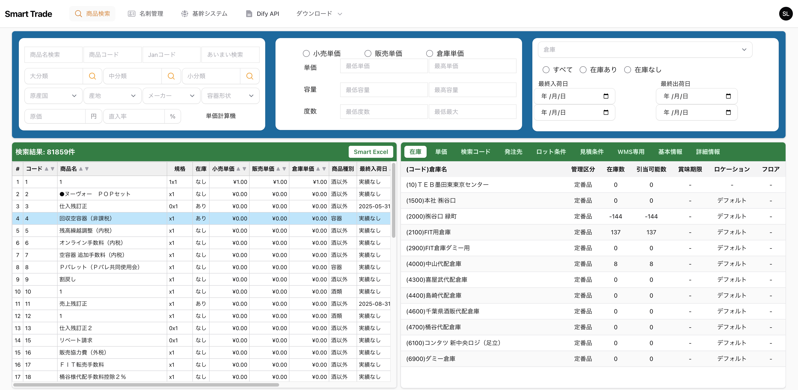

---

# 📦 WMS入出荷画面 仕様書（Filament 4 + Laravel 12 + Tailwind 4）

---

## 1️⃣ 目的

本システムは基幹と同一DBを参照しつつ、
倉庫業務（入荷・出荷・在庫・ロケーション管理）を行うための
**専用WMSフロントサイト**を構築するものである。

既存 Filament Resource は廃止し、本仕様画面をメインUIとする。
目的は以下の3点：

* 現場作業者が操作しやすい「フルスクリーン操作UI」
* 入荷～出荷～在庫照会を一貫して扱う統合画面
* フィルタ・無限スクロール・一括アクションなどの操作効率最適化

---

## 2️⃣ 使用技術スタック

| 区分      | 技術・バージョン          | 備考                    |
| ------- | ----------------- | --------------------- |
| フレームワーク | Laravel 12.x      | PHP 8.4 対応            |
| 管理UI    | Filament 4.x      | Panel + Custom Page構成 |
| スタイリング  | Tailwind CSS 4.x  | Smart Trade統一デザイン     |
| フロント    | Livewire 3.x      | 双方向同期                 |
| DB      | MySQL 8.x         | BoozeCore共通DB         |
| Excel出力 | maatwebsite/excel | Smart Excel出力対応       |

---

## 3️⃣ 画面構成

### レイアウト概要

```
----------------------------------------------------------
| 上部：検索・フィルタパネル (filters)                  |
----------------------------------------------------------
| 下部：2ペインレイアウト (result-list / detail-panel)  |
|   ├─ 左：検索結果リスト（無限スクロール＋チェック）   |
|   └─ 右：詳細パネル（クリック時詳細表示）             |
----------------------------------------------------------
```

* 画面全体を100%使用（`maxContentWidth('full')`）
* Resourceベースではなく、**Custom Page構成**
* レイアウトは `grid grid-cols-12` により柔軟に再配置可能
* Tailwind固定高さを活用（`h-[calc(100vh-64px)]`）

---

## 4️⃣ コンポーネント構造

| コンポーネント                    | 役割            | 主な機能                                  |
| -------------------------- | ------------- | ------------------------------------- |
| `WmsInboundOutbound`（Page） | 全体ページ管理       | レイアウト構成、Livewire統合                    |
| `Filters`                  | 検索条件入力        | 商品・倉庫・在庫状態・日付条件など                     |
| `ResultList`               | 検索結果リスト       | 無限スクロール／チェックボックス選択／一括アクション／クリックイベント発火 |
| `DetailPanel`              | 詳細情報表示        | 商品別・伝票別の詳細、在庫・ロケ・履歴など表示               |
| `Modal Components`（後続追加）   | 入荷登録・出荷確定・棚移動 | 各種モーダル操作                              |

---

## 5️⃣ ページ仕様詳細

### ① 上部：フィルタパネル

| 項目                 | 型             | 説明             |
|--------------------|---------------|----------------|
| 商品名 / コード / JAN    | TextInput     | 部分一致検索         |
| 倉庫                 | Select        | `warehouses`参照 |
| 出荷日   （期間）(or 入荷日） | DatePicker ×2 | from / to      |
| 出荷前・引き当て済み・出荷完了    | multiselect   | |
| クリアボタン             | Button        | 条件リセット         |

**動作仕様**

* 入力変更時 →  イベントをemit

---

### ② 下部：左側（ResultList）

| 機能      | 内容                              |
|---------|---------------------------------|
| 表示内容    | 商品コード/商品名/出荷数(or入荷数) / ケース ・ バラ |
| 表形式     | Filament Table 拡張 + Livewire    |
| 無限スクロール | 次ページ自動読込                        |
| 選択列     | チェックボックス（`selected[]` 管理）       |
| アクションバー | Excel出力                         |
| 並び替え    | 在庫数／入荷日／倉庫単価列クリック対応             |
| イベント    | 行クリックで`show-detail`発火           |

**動作仕様**

* チェックなし → 全件対象（Excelなど）
* チェックあり → 選択行対象
* アクションボタン押下 → Livewireメソッド実行

---

### ③ 下部：右側（DetailPanel）

| セクション    | 内容                         |
| -------- |----------------------------|
| 基本情報     | 商品コード・商品名・規格・入荷数・引き当て数・JAN |

**動作仕様**

* 左リストクリック時に `$emit('show-detail', id)`
* 該当商品データ（Item）を lazy load

---

参考資料 - 
商品検索画面のサンプル。これはFilament3で作成されている。

参考コード
/Users/jungsinyu/Projects/smart-search/app/Livewire/Search/ProductItemDetail.php
/Users/jungsinyu/Projects/smart-search/app/Livewire/Search/ProductSearchFilters.php
/Users/jungsinyu/Projects/smart-search/app/Livewire/Search/ProductSearchResults.php
/Users/jungsinyu/Projects/smart-search/app/Livewire/Search/CategorySearchModal.php
/Users/jungsinyu/Projects/smart-search/app/Livewire/Search/ManufacturerSearchModal.php


/Users/jungsinyu/Projects/smart-search/resources/views/livewire/search/category-search-modal.blade.php
/Users/jungsinyu/Projects/smart-search/resources/views/livewire/search/manufacturer-search-modal.blade.php
/Users/jungsinyu/Projects/smart-search/resources/views/livewire/search/product-item-detail.blade.php
/Users/jungsinyu/Projects/smart-search/resources/views/livewire/search/product-search-filters.blade.php
/Users/jungsinyu/Projects/smart-search/resources/views/livewire/search/product-search-results.blade.php

