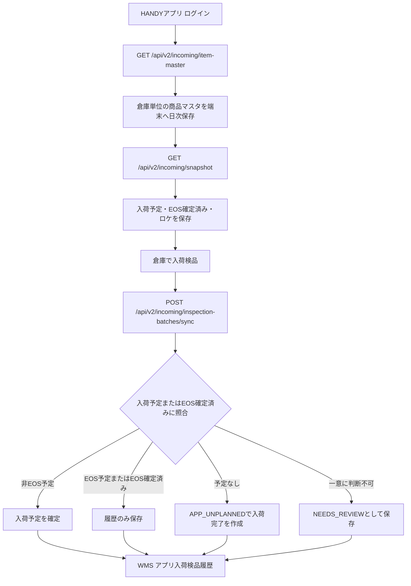

# HANDYアプリ 入荷検品API v2 仕様書

作成日: 2026-08-08

## 目的

HANDYアプリで入荷予定を事前ダウンロードし、倉庫内で入荷検品を行った結果をWMSへ同期するためのAPI仕様を定義する。

今回のv2 APIでは、既存の入荷APIは変更しない。EOS(JX)発注済みの入荷予定は、EOS受信データによる自動入荷確定を正とするため、HANDYアプリで検品しても入荷予定を直接更新しない。EOS対象の検品は履歴として保存し、数量差異や確認作業はWMS画面で行う。

## 対象範囲

- HANDYアプリ向け `/api/v2/incoming` の通信仕様
- 入荷予定スナップショットの取得
- アプリ検品結果の同期
- EOS対象、EOS確定済み、予定なし入荷、分納、超過入荷の扱い
- 仮想倉庫を含む入荷予定照合
- WMS側に残すアプリ入荷検品履歴

## 対象外

- 既存 `/api/incoming/*` の仕様変更
- EOS受信、照合、入荷確定バッチの置き換え
- sakemaru-ai-core側の仕入データ表示、権限制御
- HANDYアプリの画面デザイン詳細
- 仕入データ連携APIの新設

## 基本方針

1. 既存APIと同じ認証方式、同じレスポンス形式を使う。
2. HANDYアプリは作業開始時に倉庫単位の商品マスタを1日1回取得し、端末に永続キャッシュする。
3. HANDYアプリは入荷予定同期時に、入荷予定・EOS確定済み照合用データ・ロケーションのみを取得する。
4. EOS対象の入荷予定は、アプリからは入荷確定しない。検品履歴のみ保存する。
5. EOSが先に確定済みの場合も、予定なし入荷を新規作成せず、EOS確定済み履歴に紐づけて履歴のみ保存する。
6. 非EOSの入荷予定は、アプリ検品結果で入荷確定できる。
7. 入荷予定を超過した数量は、元伝票番号を使って `APP_UNPLANNED` の入荷完了データを作成する。
8. 入荷予定が見つからないものは、直近3日以内のEOS確定済みを確認する。見つからなければ `APP_UNPLANNED` として入荷完了データを作成する。
9. 一意に判断できないものは自動確定せず、アプリ入荷検品履歴に `NEEDS_REVIEW` として残す。
10. 作業倉庫はリクエスト倉庫のまま保存し、入荷予定・EOS確定済みの照合対象だけ同一実倉庫配下の倉庫IDに広げる。

## 用語

| 用語 | 意味 |
| --- | --- |
| 作業倉庫 | HANDYアプリで選択した倉庫。履歴バッチや予定なし入荷の `warehouse_id` として保存する |
| 照合対象倉庫 | 作業倉庫と同一実倉庫配下の倉庫ID配列。入荷予定・EOS確定済みの検索に使う |
| EOS対象 | JX/EOS送信履歴がある入荷予定。`is_eos_sent = true` |
| EOS確定済み | EOS受信データにより `CONFIRMED` になった入荷予定 |
| 予定なし入荷 | アプリ検品で該当入荷予定が見つからず、新規作成する入荷完了データ |
| 総バラ数 | ケース数、バラ数を入数で換算したバラ数量 |
| 検品履歴 | アプリ同期で `wms_incoming_app_inspection_*` に保存する履歴 |
| 要確認 | 自動で確定・履歴紐づけできないため、WMS画面で確認が必要な状態 |

## システム全体の流れ



## 認証

既存APIと同じ。

- `X-API-Key` ヘッダー必須
- `/api/auth/login` で取得したBearer token必須
- ルートは `api.key` と `auth:sanctum` の両方を通る

例:

```http
GET /api/v2/incoming/snapshot?warehouse_id=91 HTTP/1.1
Host: wms.example.test
X-API-Key: {api_key}
Authorization: Bearer {token}
Accept: application/json
```

## 共通レスポンス形式

成功時:

```json
{
  "is_success": true,
  "code": "SUCCESS",
  "result": {
    "data": {}
  }
}
```

バリデーションエラー時:

```json
{
  "is_success": false,
  "code": "VALIDATION_ERROR",
  "result": {
    "data": null,
    "error_message": "Validation failed",
    "errors": {
      "warehouse_id": ["The warehouse id field is required."]
    }
  }
}
```

同期APIでは、明細単位の業務エラーはHTTP 200で返る。各明細の `result_status` と `review_reason` を見て、アプリ側で結果表示する。

## API一覧

| メソッド | URL | 用途 |
| --- | --- | --- |
| GET | `/api/v2/incoming/item-master` | 入荷検品用商品マスタ取得 |
| GET | `/api/v2/incoming/snapshot` | 入荷検品用スナップショット取得 |
| POST | `/api/v2/incoming/inspection-batches/sync` | アプリ入荷検品結果同期 |

## GET /api/v2/incoming/snapshot

### 用途

作業倉庫単位で、HANDYアプリに必要な入荷予定・EOS確定済み照合用データ・ロケーションを取得する。商品マスタ全件は含めず、`GET /api/v2/incoming/item-master` の日次キャッシュを利用する。

### リクエスト

| パラメータ | 必須 | 型 | 内容 |
| --- | --- | --- | --- |
| warehouse_id | 必須 | integer | 作業倉庫ID |
| inspection_date | 任意 | date | 検品日。未指定時はサーバ日付 |

例:

```http
GET /api/v2/incoming/snapshot?warehouse_id=91&inspection_date=2026-08-08
```

### レスポンス構造

```json
{
  "is_success": true,
  "code": "SUCCESS",
  "result": {
    "data": {
      "version": "v2",
      "generated_at": "2026-08-08T10:00:00+09:00",
      "inspection_date": "2026-08-08",
      "warehouse": {},
      "rules": {},
      "schedules": [],
      "confirmed_eos_index": [],
      "items": [],
      "locations": []
    }
  }
}
```

### rules

| 項目 | 内容 |
| --- | --- |
| eos_inspection_policy | EOS対象の扱い。固定で `HISTORY_ONLY` |
| eos_confirmed_index_days | EOS確定済み照合期間。固定で `3` |
| unplanned_order_source | 予定なし入荷の `order_source`。固定で `APP_UNPLANNED` |
| quantity_input | 数量入力方式。固定で `CASE_AND_PIECE` |
| item_master_sync | 商品マスタ同期方式。固定で `DAILY_CACHE` |
| matching_warehouse_ids | 入荷予定・EOS確定済み照合に使う倉庫ID配列 |

### schedules

未確定の入荷予定。対象ステータスは `PENDING` と `PARTIAL`。

主な項目:

| 項目 | 内容 |
| --- | --- |
| id | 入荷予定ID |
| warehouse_id | 入荷予定の倉庫ID。仮想倉庫分が含まれる可能性がある |
| warehouse | 入荷予定側の倉庫情報 |
| slip_number | 伝票番号 |
| order_source | `AUTO`, `MANUAL`, `RECEIVED`, `TRANSFER`, `APP_UNPLANNED` など |
| order_source_label | 表示用区分 |
| inspection_policy | アプリがこの予定に対して取るべき処理方針 |
| is_eos_sent | EOS送信済みか |
| status | 入荷予定ステータス |
| order_date | 発注日 |
| expected_arrival_date | 入荷予定日 |
| actual_arrival_date | 入荷日 |
| contractor | 発注先 |
| item | 商品 |
| location | デフォルトまたは予定ロケーション |
| quantity | 数量情報 |

item:

| 項目 | 内容 |
| --- | --- |
| id | 商品ID |
| code | 商品CD |
| name | 商品名 |
| packaging | 荷姿。アプリの規格表示に利用 |
| volume | 容量 |
| volume_unit | 容量単位 |
| capacity_case | ケース入数 |
| capacity_carton | ボール入数 |

quantity:

| 項目 | 内容 |
| --- | --- |
| quantity_type | 入荷予定の数量単位 |
| expected_quantity | 予定数量 |
| received_quantity | 入荷済み数量 |
| remaining_quantity | 残数量 |
| expected_piece_quantity | 発注総バラ数 |
| received_piece_quantity | 入荷総バラ数 |
| remaining_piece_quantity | 残総バラ数 |
| capacity_case | ケース入数 |

### confirmed_eos_index

EOSが先に入荷確定済みだった場合に、アプリ側で予定なし入荷として誤作成しないための軽量インデックス。

取得期間は検品日を含む過去3日。

例: 検品日が `2026-08-08` の場合、対象は `2026-08-06` から `2026-08-08`。

主な項目:

| 項目 | 内容 |
| --- | --- |
| id | 確定済み入荷予定ID |
| warehouse_id | 入荷確定データの倉庫ID |
| warehouse_code | 倉庫CD |
| warehouse_name | 倉庫名 |
| slip_number | 伝票番号 |
| item_id | 商品ID |
| item_code | 商品CD |
| contractor_id | 発注先ID |
| contractor_code | 発注先CD |
| actual_arrival_date | 入荷日 |
| expected_arrival_date | 入荷予定日 |
| received_piece_quantity | 入荷総バラ数 |

### items

互換用フィールド。スナップショットでは商品マスタ全件を返さないため、通常は空配列。

入荷予定に必要な商品情報は `schedules[].item` に含める。予定なし入荷の商品検索やJAN照合は、`GET /api/v2/incoming/item-master` の端末キャッシュを使う。

## GET /api/v2/incoming/item-master

### 用途

作業倉庫で取扱可能な商品マスタを取得する。HANDYアプリは倉庫ごとに1日1回だけ取得し、アプリ再起動後も使えるよう端末に永続保存する。

入荷予定同期では商品マスタ全件を再取得しない。入荷予定にない商品コードを登録しようとしてローカルマスタに存在しない場合、アプリは「商品が見つかりません。最新マスタを取得しますか？」と表示し、ユーザ確認後にこのAPIを再取得する。

### リクエスト

| パラメータ | 必須 | 型 | 内容 |
| --- | --- | --- | --- |
| warehouse_id | 必須 | integer | 作業倉庫ID |

例:

```http
GET /api/v2/incoming/item-master?warehouse_id=91
```

### レスポンス構造

```json
{
  "is_success": true,
  "code": "SUCCESS",
  "result": {
    "data": {
      "version": "v2",
      "generated_at": "2026-08-08T10:00:00+09:00",
      "master_date": "2026-08-08",
      "warehouse": {},
      "rules": {
        "item_master_sync": "DAILY_CACHE",
        "matching_warehouse_ids": [91]
      },
      "items": []
    }
  }
}
```

### items

作業倉庫で取扱可能な商品マスタ。

取得対象は、照合対象倉庫のいずれかで以下に該当する有効商品。

- `item_incoming_default_locations` がある
- `real_stocks` がある

主な項目:

| 項目 | 内容 |
| --- | --- |
| id | 商品ID |
| code | 商品CD |
| name | 商品名 |
| kana | カナ |
| volume | 容量 |
| volume_unit | 容量単位 |
| capacity_case | ケース入数 |
| capacity_carton | ボール入数 |
| packaging | 荷姿 |
| temperature_type | 温度区分 |
| uses_expiration_date | 賞味期限管理対象か |
| supplier_id | 仕入先ID |
| search_codes | JAN、検索CD |
| item_quantity_codes | 6缶パック、4缶パックなどの数量コード |
| default_location | 作業倉庫での入荷デフォルトロケーション |
| contractors | 実倉庫側の商品発注先情報 |

### locations

作業倉庫のロケーション一覧。

照合対象倉庫ではなく、リクエストされた作業倉庫のロケーションのみ返す。

## POST /api/v2/incoming/inspection-batches/sync

### 用途

HANDYアプリで検品した明細をWMSへ同期する。オフライン作業後の一括送信を想定する。

同じ `client_batch_uuid` と `client_line_uuid` は冪等に扱う。アプリは再送時に同じUUIDを使い、別の作業セッションで同じ `client_batch_uuid` を再利用しない。

### リクエスト

```json
{
  "client_batch_uuid": "app-batch-20260808-0001",
  "warehouse_id": 91,
  "inspection_date": "2026-08-08",
  "inspected_at": "2026-08-08T10:30:00+09:00",
  "picker_id": 123,
  "device_id": "handy-001",
  "app_version": "2.0.0",
  "details": [
    {
      "client_line_uuid": "line-0001",
      "incoming_schedule_id": 94161,
      "item_id": 211119,
      "scanned_code": "4901004201812",
      "slip_number": "91461015689",
      "contractor_id": 1021,
      "location_id": 12345,
      "case_quantity": 34,
      "piece_quantity": 0,
      "capacity_case": 24,
      "total_piece_quantity": 816,
      "expiration_date": "2026-12-31",
      "inspected_at": "2026-08-08T10:31:00+09:00"
    }
  ]
}
```

### バッチ項目

| 項目 | 必須 | 型 | 内容 |
| --- | --- | --- | --- |
| client_batch_uuid | 必須 | string, max 80 | アプリ側の検品バッチUUID |
| warehouse_id | 必須 | integer | 作業倉庫ID |
| inspection_date | 任意 | date | 検品日。未指定時はサーバ日付 |
| inspected_at | 任意 | datetime | 検品日時 |
| picker_id | 任意 | integer | 作業者ID |
| device_id | 任意 | string, max 80 | 端末ID |
| app_version | 任意 | string, max 40 | アプリバージョン |
| details | 必須 | array, 1..1000 | 検品明細 |

### 明細項目

| 項目 | 必須 | 型 | 内容 |
| --- | --- | --- | --- |
| client_line_uuid | 必須 | string, max 80 | アプリ側の明細UUID |
| incoming_schedule_id | 任意 | integer | スナップショット上の入荷予定ID |
| item_id | 任意 | integer | 商品ID |
| item_code | 任意 | string, max 32 | 商品CD |
| item_name | 任意 | string, max 255 | 商品名。履歴補助用 |
| scanned_code | 任意 | string, max 64 | JANまたは検索CD |
| slip_number | 任意 | string, max 32 | 伝票番号 |
| contractor_id | 任意 | integer | 発注先ID |
| location_id | 任意 | integer | ロケーションID |
| case_quantity | 任意 | integer, min 0 | ケース数 |
| piece_quantity | 任意 | integer, min 0 | バラ数 |
| total_piece_quantity | 任意 | integer, min 0 | 総バラ数。指定時はケース/バラより優先 |
| capacity_case | 任意 | integer, min 1 | ケース入数 |
| expiration_date | 任意 | date | 賞味期限 |
| inspected_at | 任意 | datetime | 明細検品日時 |

### 数量ルール

- サーバ側では総バラ数を基準に処理する。
- `total_piece_quantity` が送信された場合は、その値を優先する。
- `total_piece_quantity` がない場合は `case_quantity * capacity_case + piece_quantity` で計算する。
- `capacity_case` がない場合は、商品マスタまたは入荷予定の商品入数を使う。
- いずれも取得できない場合は `1` として扱う。
- 入荷予定の数量単位がケースまたはボールで、総バラ数を予定単位に割り切れない場合は `NEEDS_REVIEW` とする。

### レスポンス

```json
{
  "is_success": true,
  "code": "SUCCESS",
  "result": {
    "data": {
      "batch": {
        "id": 1,
        "client_batch_uuid": "app-batch-20260808-0001",
        "status": "COMPLETED",
        "total_detail_count": 1,
        "success_count": 1,
        "history_only_count": 0,
        "review_count": 0,
        "error_count": 0
      },
      "details": [
        {
          "id": 10,
          "client_line_uuid": "line-0001",
          "incoming_schedule_id": 94161,
          "linked_confirmed_schedule_id": 94161,
          "created_schedule_id": null,
          "item_id": 211119,
          "item_code": "211119",
          "item_name": "商品名",
          "inspection_policy": "APP_CONFIRM_ALLOWED",
          "result_status": "CONFIRMED",
          "review_reason": null,
          "inspected_total_piece_quantity": 816,
          "applied_piece_quantity": 816,
          "shortage_piece_quantity": 0
        }
      ]
    }
  }
}
```

### batch.status

| 値 | 内容 |
| --- | --- |
| RECEIVED | 受付済み。通常、同期完了後はこの状態では返らない |
| COMPLETED | 全明細の処理が完了 |
| PARTIAL_FAILED | 一部明細で例外エラーが発生 |

### inspection_policy

| 値 | HANDY側の意味 |
| --- | --- |
| APP_CONFIRM_ALLOWED | アプリ同期で入荷確定可能 |
| EOS_HISTORY_ONLY | EOS自動入荷確定対象。アプリは履歴のみ |
| EOS_ALREADY_CONFIRMED | EOSで確定済み。アプリは履歴のみ |
| TRANSFER_WEB_ONLY | 店間移動。アプリでは確定不可 |
| PURCHASE_TRANSMITTED_LOCKED | 仕入連携済み。アプリでは更新不可 |
| NEEDS_REVIEW | WMS画面で確認が必要 |

### result_status

| 値 | 内容 |
| --- | --- |
| HISTORY_ONLY | 履歴のみ保存した |
| CONFIRMED | 既存入荷予定を入荷確定した |
| APP_UNPLANNED_CREATED | 予定なし入荷として入荷完了データを作成した |
| EOS_ALREADY_CONFIRMED | 直近EOS確定済みへ紐づけ、履歴のみ保存した |
| NEEDS_REVIEW | 自動処理せず要確認として保存した |
| ERROR | 明細処理中に例外が発生した |

## 処理ルール

### 1. 入荷予定IDが指定された場合

`incoming_schedule_id` を優先して照合する。ただし、検索対象は作業倉庫そのものではなく `matching_warehouse_ids` に含まれる倉庫。

- 見つからない場合: `NEEDS_REVIEW`
- 商品が一致しない場合: `NEEDS_REVIEW`
- EOS対象の場合: 履歴のみ
- 店間移動の場合: `NEEDS_REVIEW`
- 仕入連携済みの場合: 履歴のみ
- 非EOSで未確定の場合: 入荷確定

### 2. 入荷予定IDがない場合

商品を特定したうえで、未確定入荷予定を検索する。

検索条件:

- `matching_warehouse_ids`
- `item_id`
- ステータス `PENDING` または `PARTIAL`
- `slip_number` があれば伝票番号も一致
- `contractor_id` があれば発注先も一致

一致が1件ならその予定に対して処理する。複数件なら `NEEDS_REVIEW`。

### 3. EOS対象の検品

EOS対象はアプリから入荷予定を更新しない。

結果:

- `inspection_policy = EOS_HISTORY_ONLY`
- `result_status = HISTORY_ONLY`
- `review_reason = EOS自動入荷確定対象のため、アプリ検品履歴のみ保存しました。`

### 4. EOS確定済みの検品

スナップショット取得後、EOS自動連携が先に入荷確定する場合がある。この場合に予定なし入荷を誤作成しないよう、同期時にもサーバ側で直近3日以内のEOS確定済みを再検索する。

一致が1件の場合:

- `linked_confirmed_schedule_id` に確定済み入荷予定IDを保存
- `inspection_policy = EOS_ALREADY_CONFIRMED`
- `result_status = EOS_ALREADY_CONFIRMED`
- 入荷予定は更新しない

一致が複数の場合:

- `NEEDS_REVIEW`

### 5. 非EOSの通常入荷

非EOS、未確定、仕入未連携の入荷予定は、アプリ検品結果で入荷確定する。

- 検品総バラ数が残総バラ数と同じ: 通常確定
- 検品総バラ数が残総バラ数より少ない: 検品数量で確定し、不足分は欠品として完了
- 検品総バラ数が残総バラ数より多い: 既存予定を満量確定し、超過分を `APP_UNPLANNED` で作成

### 6. 分納

既存予定が `PARTIAL` の場合、残数量に対して検品する。

- 検品数量が残数量以下なら既存予定を更新して確定
- 検品数量が残数量を超える場合、残数量分は既存予定に適用し、超過分は予定なし入荷として作成
- EOS対象の分納はアプリから確定せず、履歴のみ保存する

### 7. 入荷予定を超える入荷

既存入荷予定があり、検品総バラ数が残総バラ数を超える場合は次の通り。

1. 元の入荷予定を残総バラ数まで入荷確定する
2. 超過分を `APP_UNPLANNED` の入荷完了データとして作成する
3. 伝票番号は元伝票番号を利用する
4. 作業倉庫はリクエストされた `warehouse_id` を使う

### 8. 入荷予定なし

未確定入荷予定も直近EOS確定済みも見つからない場合は、`APP_UNPLANNED` として入荷完了データを作成する。

作成条件:

- 商品が一意に特定できる
- 発注先または商品発注先マッピングが特定できる
- 検品総バラ数が1以上

発注先が特定できない場合は `NEEDS_REVIEW`。

### 9. 店間移動

店間移動はアプリ入荷検品APIでは確定しない。

該当条件:

- `order_source = TRANSFER`
- `transfer_candidate_id` がある
- `source_warehouse_id` がある
- `stock_transfer_id` がある

結果は `NEEDS_REVIEW` とし、WMSまたは倉庫移動の既存導線で対応する。

### 10. 仕入連携済み

仕入連携済みの入荷完了データはアプリから更新しない。

該当条件:

- `purchase_queue_id` がある
- ステータスが `TRANSMITTED`

結果は `HISTORY_ONLY`。

## 仮想倉庫対応

HANDYアプリは作業倉庫としてリクエストした倉庫IDを使う。

一方で、入荷予定やEOS確定済みの照合では、同一実倉庫配下の倉庫IDも対象にする。

| 処理 | 倉庫IDの扱い |
| --- | --- |
| 検品バッチ保存 | リクエストされた `warehouse_id` |
| 検品明細保存 | リクエストされた `warehouse_id` |
| 未確定入荷予定取得 | `matching_warehouse_ids` |
| 同期時の入荷予定照合 | `matching_warehouse_ids` |
| EOS確定済み照合 | `matching_warehouse_ids` |
| 予定なし入荷作成 | リクエストされた `warehouse_id` |
| ロケーション取得 | リクエストされた `warehouse_id` |
| 商品発注先マッピング | 実倉庫ID |

## HANDYアプリ ユースケース

### UC-001 作業開始時に倉庫データをダウンロードする

1. ユーザがHANDYアプリで倉庫を選択する
2. アプリが当日分の商品マスタキャッシュを確認する
3. 当日分がなければ `/api/v2/incoming/item-master` を呼び、商品マスタを端末に保存する
4. アプリが `/api/v2/incoming/snapshot` を呼ぶ
5. 入荷予定、EOS確定済み、ロケーションを端末に保存する
6. 以後、ネットワークが不安定でも検索・検品できる

期待結果:

- EOS対象はアプリ上で「履歴のみ」対象として表示できる
- 非EOSは入荷確定可能として表示できる
- 予定なし商品も商品マスタから検索できる

### UC-002 非EOSの入荷予定を検品して確定する

1. ユーザが入荷予定を選択する
2. ケース数、バラ数、賞味期限、ロケーションを入力する
3. アプリが同期する
4. WMSが入荷予定を確定する

期待結果:

- `result_status = CONFIRMED`
- `linked_confirmed_schedule_id` が返る
- 入荷予定はWMS上で入荷完了になる

### UC-003 EOS対象を検品する

1. ユーザがEOS対象の入荷予定を検品する
2. アプリが同期する
3. WMSは入荷予定を更新せず、検品履歴だけ保存する

期待結果:

- `inspection_policy = EOS_HISTORY_ONLY`
- `result_status = HISTORY_ONLY`
- EOS受信データの入荷確定が優先される

### UC-004 EOSが先に確定済みだったデータを検品する

1. アプリのスナップショット取得後、夜間や定期実行でEOS入荷確定が完了する
2. ユーザがオフラインで検品した結果を後から同期する
3. WMSが直近3日以内のEOS確定済みを再照合する

期待結果:

- 一致が1件なら `EOS_ALREADY_CONFIRMED`
- 予定なし入荷は作られない
- 数量差異はWMSのアプリ入荷検品履歴で確認する

### UC-005 分納または一部欠品

1. 入荷予定の数量より少ない数量で検品する
2. アプリが同期する
3. 非EOSなら検品数量で入荷確定し、不足分は欠品完了扱いにする

期待結果:

- `result_status = CONFIRMED`
- `shortage_piece_quantity` に不足総バラ数が返る
- 後日追加入荷がある場合は、別途予定なし入荷または新規入荷予定として扱う

### UC-006 入荷予定を超える数量を検品する

1. 入荷予定の残数量を超えて検品する
2. WMSが元入荷予定を満量確定する
3. 超過分を `APP_UNPLANNED` として作成する

期待結果:

- `result_status = APP_UNPLANNED_CREATED`
- `linked_confirmed_schedule_id` に元入荷予定ID
- `created_schedule_id` に超過分の入荷完了ID
- 伝票番号は元伝票番号を利用

### UC-007 入荷予定がない商品を検品する

1. ユーザが商品検索またはJANスキャンで商品を選ぶ
2. 入荷予定に該当がない状態で同期する
3. WMSが直近EOS確定済みを確認する
4. EOS確定済みもなければ `APP_UNPLANNED` として作成する

期待結果:

- 作成可能なら `APP_UNPLANNED_CREATED`
- 商品または発注先を一意に決められなければ `NEEDS_REVIEW`

### UC-008 商品が不明または候補が複数ある

1. JANまたは検索CDから商品候補が複数見つかる
2. または商品が見つからない
3. WMSは自動作成せず履歴に残す

期待結果:

- `result_status = NEEDS_REVIEW`
- `review_reason` に理由が入る
- WMSのアプリ入荷検品履歴で確認する

### UC-009 オフライン作業後に再送する

1. 同期中にネットワークが切れる
2. アプリが同じ `client_batch_uuid` と `client_line_uuid` で再送する
3. WMSは処理済み明細を重複処理しない

期待結果:

- 同じ明細は既存の検品履歴を返す
- 入荷確定や予定なし入荷が重複作成されない

### UC-010 仮想倉庫の入荷予定を検品する

1. ユーザは作業倉庫を選択する
2. スナップショットには同一実倉庫配下の入荷予定も含まれる
3. アプリは返却された `warehouse_id` と `warehouse` を表示できる
4. 同期時も同じ照合対象倉庫で検索される

期待結果:

- 作業履歴の倉庫はリクエスト倉庫
- 入荷予定照合は仮想倉庫分も対象
- 予定なし入荷を作る場合はリクエスト倉庫で作成

## HANDYアプリ表示要件

- 入荷予定一覧では `inspection_policy` を見て操作可否を表示する。
- EOS対象は「EOS自動確定対象。検品履歴のみ保存」と表示する。
- 店間移動はアプリ確定不可として表示する。
- 仕入連携済みは更新不可として表示する。
- 同期結果画面では、明細ごとに `result_status` と `review_reason` を表示する。
- `NEEDS_REVIEW` はユーザが再同期で解決できるものではなく、WMS側確認が必要な状態として扱う。
- 数量入力はケース・バラ入力を許可し、アプリ側で総バラ数も計算して送信する。
- 6缶パック、4缶パックなどは `item_quantity_codes` を使って商品検索・数量補助表示に利用する。

## WMS側管理画面

メニュー:

```text
入荷 > アプリ入荷検品履歴
```

表示対象:

- 検品バッチ
- 検品明細
- EOS履歴のみデータ
- 予定なし入荷作成データ
- 要確認データ
- エラー明細

確認観点:

- EOS実績とアプリ検品数量の差異
- 予定なし入荷として作成された明細
- 商品不明、発注先不明、複数候補
- 店間移動をアプリで検品した明細

## DB保存要件

### wms_incoming_app_inspection_batches

アプリ同期単位の親レコード。

主な項目:

- `client_batch_uuid`
- `warehouse_id`
- `inspection_date`
- `inspected_at`
- `inspected_by`
- `picker_id`
- `device_id`
- `app_version`
- `status`
- 集計件数
- `payload_hash`

### wms_incoming_app_inspection_details

アプリ同期明細。

主な項目:

- `client_line_uuid`
- `warehouse_id`
- `incoming_schedule_id`
- `linked_confirmed_schedule_id`
- `created_schedule_id`
- 商品、発注先、ロケーション
- 検品数量
- `inspection_policy`
- `result_status`
- `review_reason`
- `raw_payload`

### wms_order_incoming_schedules

予定なし入荷を表す `order_source` として次を追加する。

```text
APP_UNPLANNED
```

表示名:

```text
予定なし入荷
```

## エラー・要確認になる代表例

| ケース | 結果 |
| --- | --- |
| 検品数量が0以下 | `NEEDS_REVIEW` |
| 商品が特定できない | `NEEDS_REVIEW` |
| 商品候補が複数 | `NEEDS_REVIEW` |
| 指定入荷予定が見つからない | `NEEDS_REVIEW` |
| 入荷予定の商品と検品商品が違う | `NEEDS_REVIEW` |
| 条件に一致する未確定入荷予定が複数 | `NEEDS_REVIEW` |
| 直近3日以内のEOS確定済み候補が複数 | `NEEDS_REVIEW` |
| 発注先を特定できない予定なし入荷 | `NEEDS_REVIEW` |
| 店間移動 | `NEEDS_REVIEW` |
| 明細処理中の例外 | `ERROR` |

## 開発要件

### 互換性

- 既存 `/api/incoming/*` は変更しない。
- 既存HANDYアプリがv1 APIを使い続けても動作が変わらないこと。
- v2 APIは `/api/v2/incoming` 配下に限定する。

### 冪等性

- アプリは作業セッションごとに `client_batch_uuid` を発行する。
- 明細ごとに `client_line_uuid` を発行する。
- 再送時は同じUUIDを使う。
- 別作業で同じ `client_batch_uuid` を再利用しない。

### パフォーマンス

- スナップショットは倉庫単位で取得し、商品マスタ全件は含めない。
- 商品マスタは倉庫で取扱可能な商品に限定し、端末側で1日1回キャッシュする。
- EOS確定済みインデックスは検品日を含む過去3日分に限定する。
- 同期明細は1リクエスト最大1000件。
- 本番相当データでレスポンスサイズと応答時間を確認する。

### 排他制御

- 同期時は明細処理内でトランザクションを使う。
- 入荷予定照合は `lockForUpdate()` を使い、同じ予定への同時適用を防ぐ。
- 同じ `client_line_uuid` の再送は既存明細を返し、重複処理しない。

### ログ・調査性

- アプリ送信元の `device_id`, `app_version`, `picker_id` を保存する。
- 明細の元リクエストを `raw_payload` に保存する。
- 自動処理できない理由は `review_reason` に保存する。

## テスト観点

| No | 観点 | 期待結果 |
| --- | --- | --- |
| 1 | 既存 `/api/incoming/*` が変わらない | v1 APIのレスポンス・確定動作が従来通り |
| 2 | 商品マスタ取得 | 倉庫取扱商品を1日1回取得し、端末に永続キャッシュする |
| 3 | スナップショット取得 | 未確定予定、EOS確定済み、ロケが返る。商品マスタ全件は返らない |
| 4 | 仮想倉庫 | 入荷予定照合は仮想倉庫分も含む |
| 5 | 非EOS通常入荷 | `CONFIRMED` で入荷確定 |
| 6 | EOS予定 | `HISTORY_ONLY` で入荷予定は更新されない |
| 7 | EOS確定済み | `EOS_ALREADY_CONFIRMED` で予定なし入荷を作らない |
| 8 | 分納 | 残数量に対して確定 |
| 9 | 欠品 | 不足分が `shortage_piece_quantity` に出る |
| 10 | 超過入荷 | 元予定確定 + `APP_UNPLANNED` 作成 |
| 10 | 入荷予定なし | `APP_UNPLANNED` 作成 |
| 11 | 商品不明 | `NEEDS_REVIEW` |
| 12 | 発注先不明 | `NEEDS_REVIEW` |
| 13 | 再送 | 重複確定・重複作成されない |
| 14 | 6缶/4缶パック | 総バラ数換算が意図通り |
| 15 | 仕入連携済み | 履歴のみで更新されない |
| 16 | 店間移動 | アプリ確定されない |

## リリース前確認

1. `APP_UNPLANNED` のENUM追加DDLリスクを確認する。
2. 新規テーブルのインデックスを確認する。
3. `/api/v2/incoming/item-master`、`/api/v2/incoming/snapshot`、`/api/v2/incoming/inspection-batches/sync` がルート登録されていることを確認する。
4. 既存 `/api/incoming/*` の回帰テストを実施する。
5. EOS対象で入荷予定が更新されないことをテストする。
6. 直近3日以内のEOS確定済みによって予定なし入荷が防がれることをテストする。
7. 仮想倉庫の照合対象が既存APIと同じ考え方になっていることを確認する。
8. WMSのアプリ入荷検品履歴で要確認データを追跡できることを確認する。

## 現時点の注意事項

- この仕様はv2 API初期実装に合わせたHANDYアプリ向け仕様である。
- WMS側の「アプリ入荷検品履歴」画面での最終確認フローは、運用開始前に担当者の確認手順を決める必要がある。
- 大量商品マスタのレスポンスサイズは本番相当データで確認が必要。ただし通常の入荷予定同期では商品マスタ全件を返さない。
- この作業ツリーでは `vendor/autoload.php` が存在しないため、`php artisan route:list` によるルート確認は未実施。
